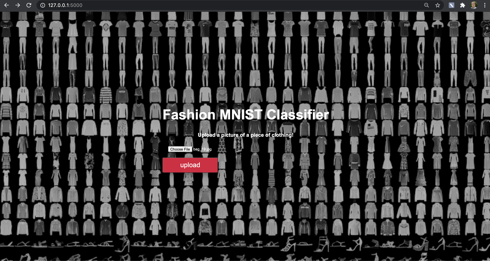
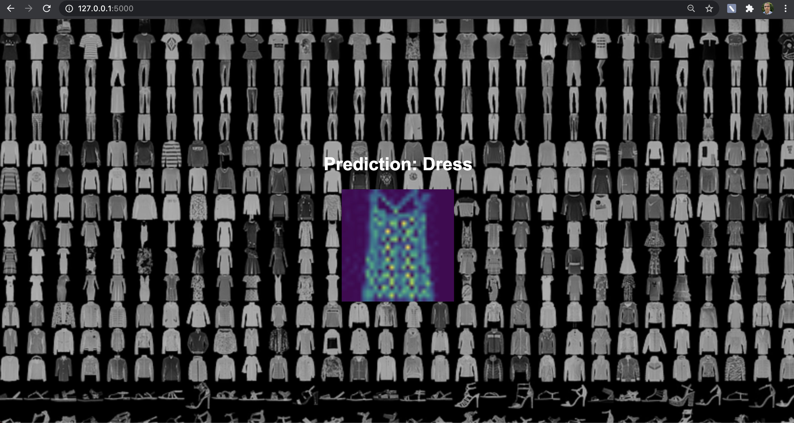

# Intro to Flask with Tensorflow Lite

- We build and save a TFLite model using the notebook in model_tflite 

- The model is trained to recognize the Fashion MNIST images

- We build a Flask app that accepts input images and returns what category the input image is predicted to be

- The frontend will look like:

- The result page will look like:

- _Make sure you use an image from the test_images folder to test your app_.
